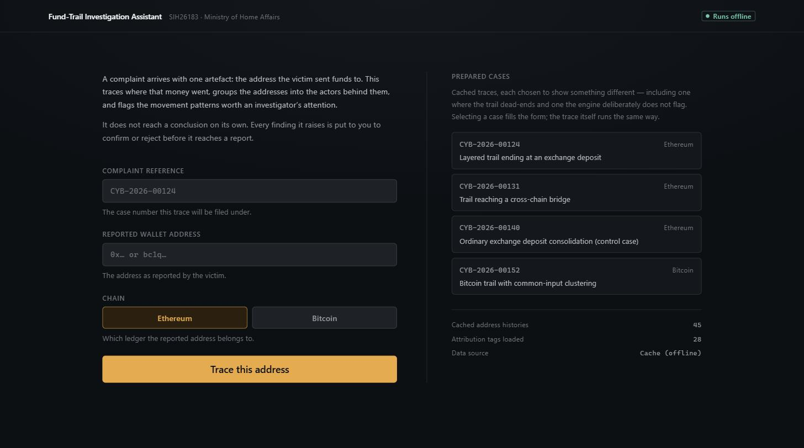
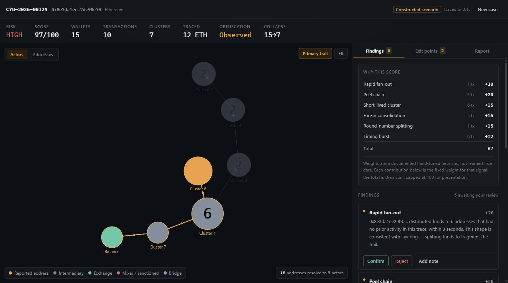
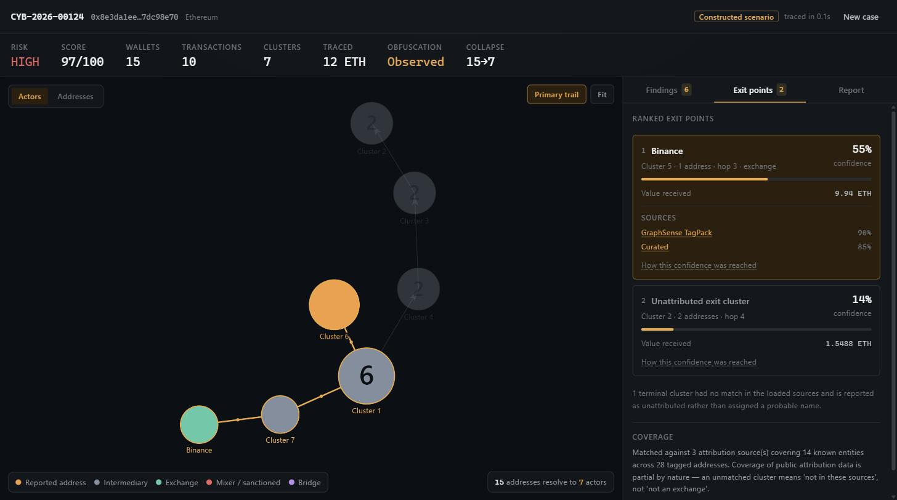
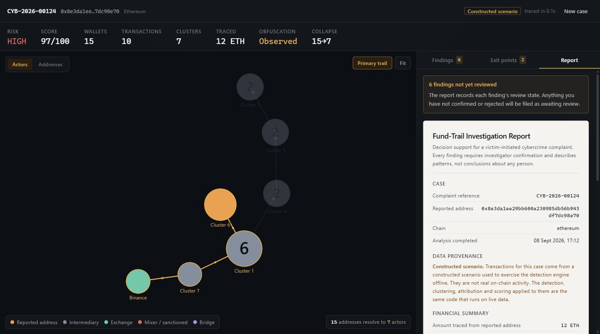
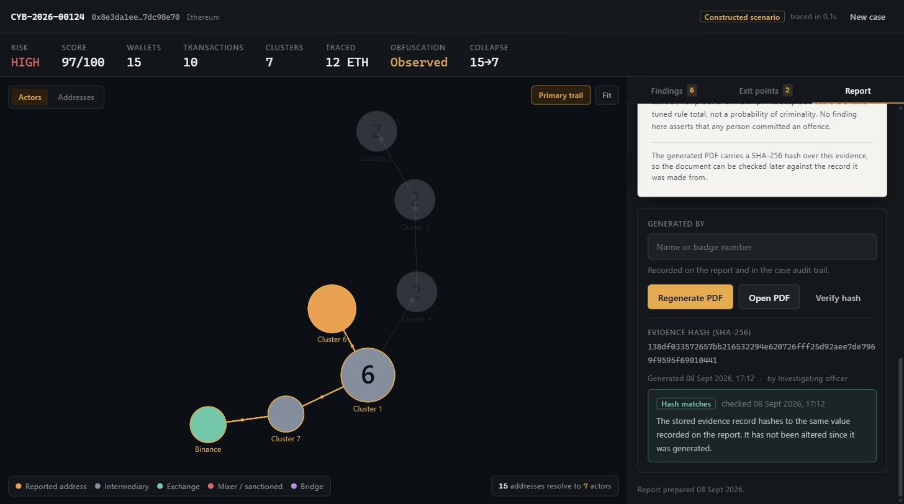
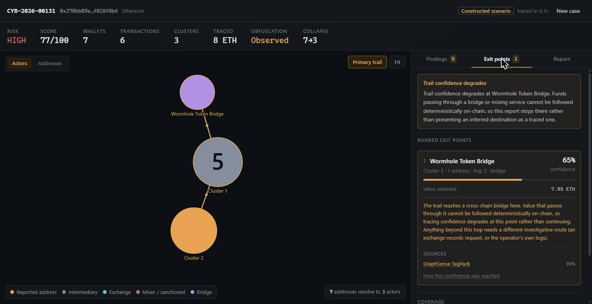
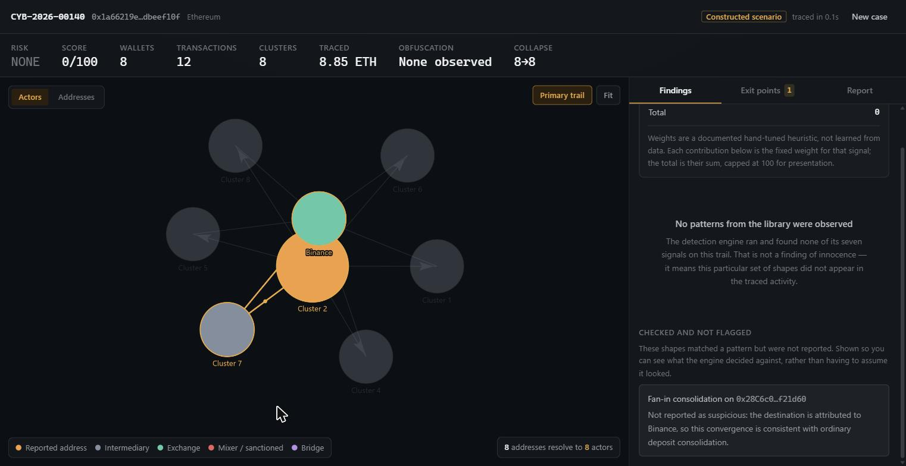

<div align="center">

# TraceX

### Fund-Trail Investigation Assistant

**From a victim's reported wallet address to a confidence-scored, evidence-backed cash-out report — in under a second, not a manual multi-hour trace.**

[](https://sih.gov.in/)
[](#)
[](#)
[](#testing)
[](#offline-by-design)
[](#)
[](#)

</div>

---

## The problem

When an Indian citizen loses money to a crypto scam, they report it through the
1930 helpline or `cybercrime.gov.in`. The investigating officer receives exactly
one artefact: **a suspect wallet address.**

From there they must answer the question that decides whether the money is
recoverable at all — *where did it go, and which exchange was it cashed out
through?* A blockchain address is pseudonymous and unfreezable. **An exchange
account is not.** It has KYC records and can be frozen.

Doing that by hand means clicking through transactions hop by hop in a block
explorer. A scammer who splits funds across 300 addresses makes it practically
impossible, and the funds are gone in hours.

## What TraceX does

```
Victim complaint  →  suspect address
                          ↓
        multi-hop transaction graph      ← cached, rate-limited, offline-capable
                          ↓
        entity clustering                ← 300 addresses collapse to ~6 actors
                          ↓
        laundering pattern detection     ← transparent rule engine, 7 signals
                          ↓
        exchange attribution             ← ranked exits, every claim sourced
                          ↓
        human review                     ← confirm / reject / annotate
                          ↓
        tamper-evident PDF report        ← SHA-256 sealed
```

It is **decision support for one victim-initiated complaint with a case ID
attached.** Not a general crypto analytics tool, and not an automated accusation
engine.

---

## The interface

### Case intake

One complaint reference, one address. Nothing else is asked for, because nothing
else is known yet.



### The investigation workspace

The trail lights up in ochre while everything off it recedes. Fifteen addresses
resolve into seven actors. The score adds up in the open: **20 + 20 + 15 + 15 +
15 + 12 = 97**, with every contribution linked to the transactions behind it.



### Ranked exit points, every claim sourced

Binance at 55% confidence with two openable source links — and the second
candidate stays **"Unattributed exit cluster"** rather than being handed a name
it hasn't earned.



### The report

The one surface that turns to paper, because it becomes a PDF that goes into a
case file. Data provenance sits in the **body**, not a footnote.



### Tamper-evident evidence

SHA-256 over a canonical JSON serialisation of the case. Re-verify at any time —
if the stored record was altered, the hashes stop matching.



---

## The two screens that matter most

Any tool can flag things. These two are the ones that show it can be trusted.

### It reports honest dead ends

When the trail reaches a cross-chain bridge, deterministic tracing is over.
TraceX says so instead of guessing what came out the other side.



> *"Trail confidence degrades at Wormhole Token Bridge. Funds passing through a
> bridge or mixing service cannot be followed deterministically on-chain, so this
> report stops there rather than presenting an inferred destination as a traced
> one."*

### It refuses to flag legitimate activity

**This is the hard part of the problem.** A laundering consolidation and an
ordinary exchange deposit produce an *identical* shape on the graph — five
addresses converging on one. Shape alone cannot tell them apart.

Below is that exact shape, into a real Binance address. **Score 0/100. Nothing
flagged.** And the engine shows its working.



> *"Fan-in consolidation on 0x28C6c0…f21d60 — Not reported as suspicious: the
> destination is attributed to Binance, so this convergence is consistent with
> ordinary deposit consolidation."*

A detector that fires on everything is worthless. Four contextual features do the
real work here: **attribution match, volume history, cluster age, dormancy.**

---

## Quick start

```bash
git clone https://github.com/Narendran-ds/TraceX.git
cd TraceX

# one-time setup
py -3.11 -m venv .venv
.venv/Scripts/python.exe -m pip install -r requirements.txt
npm --prefix frontend install
```

Then three commands — seed once, then a terminal each:

```bash
.venv/Scripts/python.exe scripts/seed.py --reset                       # 1. seed
.venv/Scripts/python.exe -m uvicorn backend.api.main:app --port 8000   # 2. API
npm --prefix frontend run dev                                          # 3. UI
```

Open **http://localhost:5173**, pick a prepared case, press Trace.

> **No API key required. No network call on the demo path.**
> `python` on many Windows machines is 3.9; this needs 3.11 — use `py -3.11`.
> On macOS/Linux the venv binary is `.venv/bin/python` instead.

<details>
<summary><b>Everything else you can run</b></summary>

```bash
.venv/Scripts/python.exe -m pytest backend/tests -q      # 170 backend tests
npm --prefix frontend test                                # 20 frontend tests
.venv/Scripts/python.exe scripts/e2e.py                   # address → PDF, offline
.venv/Scripts/python.exe scripts/evaluate.py              # the metrics harness
.venv/Scripts/python.exe scripts/build_scenarios.py       # regenerate demo cases
.venv/Scripts/python.exe scripts/build_evaluation_set.py  # regenerate labelled set
npm --prefix frontend run build && npm --prefix frontend run preview
```

Interactive API docs: **http://127.0.0.1:8000/docs**

</details>

---

## Architecture

```
┌──────────────────────────────────────────────────────────────────┐
│  React + Vite + Tailwind · force-directed graph · NDJSON stream  │
└────────────────────────────┬─────────────────────────────────────┘
                             │  frozen API contract
┌────────────────────────────┴─────────────────────────────────────┐
│  FastAPI                                                          │
│                                                                   │
│  Chain adapters ──► Cache ──► Graph builder ──► Clustering        │
│  Blockscout          api_cache   multi-hop        common-input    │
│  Etherscan V2        + token     weighted         change-address  │
│  Blockchair          bucket      dust-filtered    behavioural     │
│  Fixture                                                          │
│                             │                                     │
│         ┌───────────────────┼───────────────────┐                │
│         ▼                   ▼                   ▼                │
│   Pattern engine      Attribution         Scoring engine          │
│   7 signals           TagPacks · OFAC     weighted rules          │
│                       curated             + per-signal breakdown  │
│                             │                                     │
│                             ▼                                     │
│              Human review ──► Evidence (SHA-256) ──► PDF          │
└───────────────────────────────────────────────────────────────────┘
```

| Layer | Choice | Why |
|---|---|---|
| Backend | Python + FastAPI | Graph work is fastest in Python; auto-generated API docs |
| Graph | networkx-style adjacency, hand-rolled | No infra, full control over weighting |
| Database | SQLite | One file, nothing to crash on stage. PostgreSQL-ready DDL |
| Cache | `api_cache` table | The single biggest demo-failure preventer |
| Frontend | React + Vite + Tailwind | Fast iteration |
| Graph viz | `react-force-graph-2d` | Canvas rendering, animation support |
| PDF | reportlab | Pure Python, no system dependencies |

**Deliberate non-requirements:** no GPU, no model training, no cloud dependency.
The whole system runs on one laptop, offline.

---

## The detection engine

Seven signals, each returning a score contribution **and the transaction hashes
behind it**. Weights are a documented hand-tuned heuristic — never described as
learned or trained, because they weren't.

| Signal | Weight | Fires on |
|---|---:|---|
| Rapid fan-out | +20 | One address → N ≥ 5 previously-unseen addresses in a short window |
| Peel chain | +20 | A chain forwarding a large remainder while peeling small amounts |
| Mixer / sanctioned match | +20 | A direct attribution hit on a public designation |
| Fan-in consolidation | +15 | N ≥ 5 addresses converge — **only with contextual disambiguation** |
| Round-number splitting | +15 | A split into near-equal or round-number pieces |
| Cluster new + burst + dormant | +15 | Created recently, moved fast, went quiet |
| Timing burst | +12 | Abnormally tight transaction timing among related addresses |

Weights total 117, so the score is capped at 100 — and **the cap is shown as an
explicit line** so the arithmetic on screen always adds up.

### Why a rule engine, not a model

This output goes into a legal case file. An investigator, and eventually a court,
must be able to interrogate exactly why a conclusion was reached. A black-box
model would be a liability, not an upgrade. *"It's a rule engine and here's every
rule"* is unassailable in Q&A.

---

## Measured results

Produced by `scripts/evaluate.py` over 16 labelled cases. Regenerate any time;
results land in `data/evaluation/results/latest.md`.

| Metric | Measured |
|---|---|
| Cases matching every label | **16 / 16** |
| Patterns correctly flagged | 13 |
| Patterns missed | **0** |
| False positives | **0** |
| Correctly not flagged | 64 |
| Precision / recall | 100% / 100% |
| Correct exit in top 3 | 5 / 5 cases expecting a named exit |
| Trail-degradation calls correct | 16 / 16 |
| Median time per case | 0.007 s |
| Manual tracing baseline | **not measured** |

> ### ⚠️ Read this before quoting the numbers
>
> **All 16 cases are constructed scenarios.** These figures show that the engine
> behaves as its own documentation specifies — it fires on the shapes it defines,
> stays silent below its thresholds, and declines to flag legitimate activity.
>
> **They are not real-world detection accuracy**, and presenting them as such
> would be exactly the overclaim this project refuses to make. `evaluate.py`
> prints this caveat in its own output, so it survives being copied into a slide.
>
> The **manual baseline is genuinely missing** — nobody has stopwatched a manual
> trace yet, so the harness prints `not measured` rather than inventing the other
> half of the comparison.

### The harness found two real bugs

Both had passing unit tests and would have surfaced in front of judges.

1. **Round-number splitting fired on ordinary amounts.** `is_round_amount`
   stepped down to `0.01`, so any two-decimal figure counted as round — `1.31`
   and `0.87` were "round numbers", which is most real transactions.

2. **A sanctioned mixer wasn't a confidence boundary.** OFAC tags Tornado Cash
   `sanctioned`, correct for a sanctions source — but nothing marked it as a
   *mixing service*, so a trail through it was reported as if it could continue
   past an anonymity set. Sanctioned and mixer are independent facts: a
   sanctioned personal wallet is still traceable onward.

---

## Design principles

These are correctness requirements, not style preferences. Each is enforced by a
test, a database constraint, or both.

| # | Principle | How it's enforced |
|---|---|---|
| 1 | **Never fabricate numbers** | Nothing is pre-computed at seed time. A missing value renders as an em dash, never a zero |
| 2 | **Confidence, never certainty** | A lint greps every user-facing string for accusatory and overclaiming language — with two tests proving the lint can fail |
| 3 | **Explainability is the architecture** | The `Detection` constructor *refuses* to build a finding without backing transaction hashes |
| 4 | **Cache before you fetch** | A test asserts the response is in `api_cache` before the caller sees it |
| 5 | **Rate limits are hard constraints** | Token bucket per provider; tests pin each rate to the provider's documented limit |
| 6 | **Fail honestly, degrade gracefully** | Unhandled exceptions return a readable message, never a traceback |
| 7 | **Human-in-the-loop is mandatory** | No code path finalises a conclusion without review; rejecting recomputes the score server-side |
| 8 | **Attribution needs provenance** | `source` and `source_url` are `NOT NULL`; the ingester raises rather than storing a provenance-free tag |

---

## Offline by design

The demo never touches the network. That isn't a shortcut — it's the architecture
responding to a real constraint.

A keyless Blockchair probe from our development machine returned:

```
HTTP 430 — "Your IP address is temporary blacklisted due to
            exceeding usage of API resources"
```

That is precisely the failure a live demo cannot survive. So:

- every upstream response is cached to `api_cache` **before use**;
- cache lookup is *provider-agnostic*, which means the offline path and the
  cached-live path are **the same code path** — offline isn't a special mode;
- a token bucket per provider matches each documented free-tier limit;
- when a limit bites, the case is flagged `expansion_limited` with a readable
  note rather than silently truncated.

Blockscout's free tier **does** work without a key and backs the live Ethereum
path.

---

## Data sources

Every attribution claim is traceable to a public source. Both `source` and
`source_url` are `NOT NULL` in the schema.

| Source | What it gives | Used for |
|---|---|---|
| **GraphSense TagPacks** | Exchange hot wallets, mixers, bridges | Primary attribution layer |
| **OFAC SDN** | Sanctioned addresses from the US Treasury | High-confidence hard flags |
| **Hand-curated** | India-relevant venues, verified by hand | Small, high-precision layer |

The curated file ships with a **`pending_verification`** section naming entities
we could *not* verify from a public source. The gap is visible rather than filled
with a plausible-looking guess.

---

## Testing

```bash
.venv/Scripts/python.exe -m pytest backend/tests -q   # 170 passing
npm --prefix frontend test                             # 20 passing
```

<details>
<summary><b>What the suites cover</b></summary>

| Suite | Covers |
|---|---|
| `test_schema` | Provenance and source columns are enforced by the database |
| `test_cache` | Cache-before-use; the second fetch never hits the network |
| `test_ratelimit` | Token bucket caps burst and refills at the documented rate |
| `test_graph` | Weighting, dust filtering, expansion caps, primary trail |
| `test_clustering` | Common-input, change-address, behavioural, CoinJoin handling |
| `test_patterns` | Every detector, fired **and** silent one step below threshold |
| `test_scoring` | Contributions sum to the raw total; the cap is explicit |
| `test_attribution` | Provenance, unattributed exits, confidence boundaries |
| `test_api` | Full frozen contract, NDJSON streaming, tamper detection |
| `test_language` | Copy-honesty lint |
| `test_amounts` | Regression tests for both bugs the harness found |

</details>

**Verified end to end:** cloned to a clean directory, installed, seeded, tested,
e2e, evaluation, frontend build — all green. The full judge path was driven in
Chrome against the running stack with **zero console errors**.

---

## Repository layout

```
backend/
  adapters/     ChainAdapter · Blockscout · Etherscan V2 · Blockchair · fixture
  cache/        api_cache store + token-bucket rate limiter
  graph/        multi-hop builder, edge weighting, dust filtering
  clustering/   common-input, change-address, behavioural, CoinJoin
  patterns/     the seven-signal detection library
  scoring/      weighted engine + per-signal breakdown
  attribution/  TagPack / OFAC ingestion, matching, provenance
  evidence/     SHA-256 over canonical JSON
  reports/      PDF generation
  api/          routes, frozen contract, pipeline, views
frontend/src/
  screens/      intake · workspace · findings · attribution · report
  components/   TrailGraph + shared primitives
  contracts/    TypeScript mirror of the frozen API contract
data/
  tagpacks/ ofac/ curated/    attribution sources
  fixtures/                    demo scenarios
  evaluation/                  labelled set + measured results
scripts/        seed · build_scenarios · build_evaluation_set · evaluate · e2e
```

The frozen API contract lives in **two files that change together**:
`backend/api/contracts.py` and `frontend/src/contracts/api.ts`.

---

## Scope boundaries

Deliberately **not** built. These are decisions, not oversights.

- **Multi-chain breadth beyond BTC + ETH** — the adapter architecture is stated
  honestly instead of claimed
- **A from-scratch GNN** — wrong tool for a legal-evidence context
- **Automated exchange reporting or freezing** — legally inappropriate to automate
- **Broad chain monitoring** — scope explosion, and it crosses into surveillance
  framing

### Known limitations

- The **Bitcoin live path is unverified** — the keyless Blockchair tier
  blacklisted our IP, so BTC runs from constructed scenarios. The adapter is
  written to the documented API shape but has never seen a live response.
- **Attribution coverage is partial by nature.** An unmatched cluster means "not
  present in the sources loaded here", not "not an exchange".
- **Clustering heuristics are inferences** about common control, not proof of
  ownership.
- **The suspicion score is a hand-tuned rule total**, not a probability of
  criminality.

---

<div align="center">

**Smart India Hackathon 2026 · SIH26183**
Blockchain & Cybersecurity · Ministry of Home Affairs · Software track

*A forensic assistant, not a verdict machine.*

</div>
